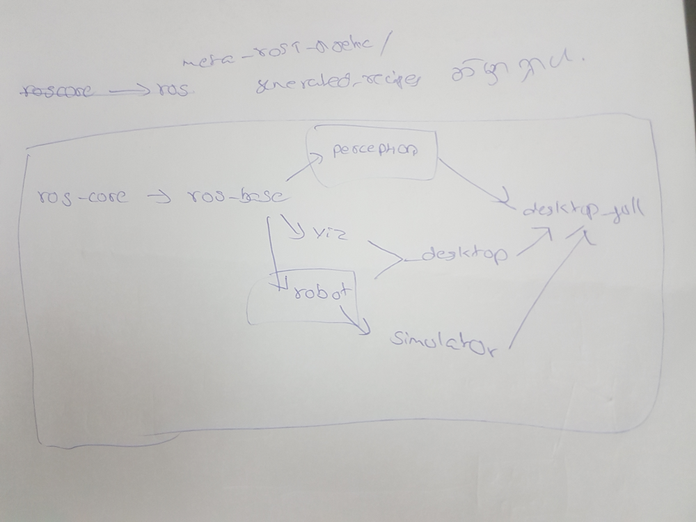

<h2> meta-rom </h2>   
        <h3>meta-romrobotics</h3>
	    <ol>
		 <li><b>rom-noetic-base.bb</b></li>
		    <ul>
		        <li>opehssh server </li>
				<li>password assigned(user=root, password=ghostman) </li>
				<li>new user assigned(user=rom, password=robotics) no ssh login, no sudoers </li>
				<li>chage for root</li>
				<li>splash screen</li>
				<li>static ip(192.168.1.10/24) assigned</li>
				<li>uart enable</li>
				<li>package management system (ipk) </li>
		    </ul>	       
	    </ol>
	    
Yocto က sh shell သုံးတာမို့လို့  /etc/profile မှာ source /opt/ros/noetic/setup.sh သွားထည့်ပါ။

	    

	    Yocto မှာ default အားဖြင့် systemd မဟုတ်ဘဲ init ဖြစ်တာကြောင့် /etc/init.d /etc/initab တို့ကို သိထားဖို့လိုပါမယ်။ init ကို မသုံးရင်လည်း systemd အသုံးပြုနိုင်ပါတယ်။ ros node တွေ auto start ဖြစ်အောင် တခြားနည်းလမ်းတွေဖြစ်တဲ့ cron တို့ ros package ထဲက auto start package တွေလဲအသုံးပြုနိုင်ပေမဲ့ ယခု yocto မှာမို့ ကန့်သတ်ချက်တွေရှိနိုင်ပြီး စမ်းသပ်ပြီးမှသာ အသုံးပြုနိုင်ပါမယ်။ အခု init နည်းလမ်းကတော့ ရိုးရှင်းပြီး အခြေခံကျပါတယ်။ init script ရေးဖို့အတွက် ROM ROBOTICS မှထုတ်ဝေမည့် " အဆင့်မြင့် ROBOT " စာအုပ်  embedded linux အခန်း  ကို ဖတ်ပါ။

<h4> rom-noetic-robot</h4>
- rom-noetic-robot ကို bitbake လုပ်ရတာတွင် opencv, pcl တို့ကို compile လုပ်သည်။ pcl lib များကို compile လုပ်ရာတွင် swap 5G ဖြင့် မအောင်မြင်ပါ။ swap 24G ပေးရာအောင်မြင်သည်။ ros meta package များဖွဲ့စည်းပုံကို ပုံတွင်ကြည့်ပါ။
 

 
- emulator ဖြင့် run ဖို့ဆို 
$ cd build_dir/tmp/deploy/images/qeum_directory
$ runqemu rom-noetic-robot-noetic-qemux86-64.qemuboot.conf 
- mobile robot အတွက် အောက်ပါ package များသွင်းရန်လိုသည်။
		- rplidar_ros
		- map_server
		- slam_gmapping
		- amcl
		- move_base
		- global_planner
		- local_planner
		- rotate_recovery
		- clear_costmap_recovery
		- costmap_2D
		- carrot_planner
		- rplidar_ros
		- သင့်ရဲ့ robot driver package

<h5> လက်ရှိဖြည့်သွင်းထားသော package များ </h5>
		IMAGE_INSTALL:append = " \
    ros-core \
    robot \
    perception \
    openslam-gmapping \
    open-karto \
    slam-gmapping \
    slam-karto \
    move-basic \
    navigation \
    robot-localization \
    rosserial \
    ros-control \
    actionlib \
    move-base-flex \
    move-base-sequence \
    slam-toolbox-msgs \
    robot-navigation \
    robot-localization \
    robot-controllers \
    amcl \
    global-planner \
    base-local-planner \
    dwa-local-planner \
    dwb-local-planner \
    carrot-planner \
"
<h5> ထည့်ဖို့ကျန်တဲ့ package များ </h5>
	- rplidar_ros
	- slam_toolbox
	- myrobot_driver
	- myrobot_description

